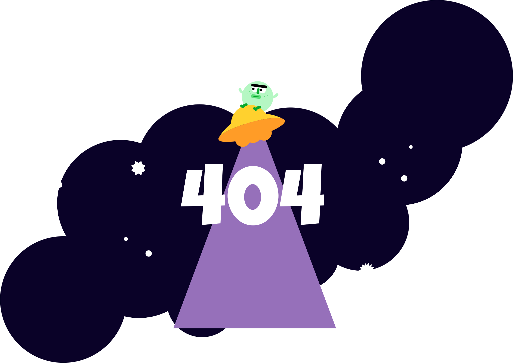

# 👽 UFO 404 Error Page

## 🚀 프로젝트 소개
이 프로젝트는 단순한 "404 Not Found" 에러 페이지를 창의적으로 재해석한 **애니메이션 웹 페이지**입니다.  
외계인과 UFO가 등장하는 우주 테마를 기반으로, 사용자가 페이지를 잘못 찾았을 때도 **재미있고 인상적인 경험**을 제공할 수 있도록 제작했습니다.

## ✨ 주요 기능 및 특징
- **SVG 기반 애니메이션**: 별, 행성, UFO, 외계인 손동작 등을 CSS 애니메이션으로 구현  
- **반응형 디자인**: 다양한 화면 크기에서도 정상적으로 작동  
- **인터랙션 애니메이션**: UFO의 빔과 숫자 "0"이 반복적으로 등장/사라지며 생동감 있는 효과 제공  
- **경쾌한 색감 & 테마**: 딥 퍼플과 네온 그린을 사용해 SF적 분위기 연출  

## 🛠 기술 스택
- **HTML5**: 페이지 구조 및 SVG 삽입  
- **CSS3 (Keyframes Animation)**: 회전, 축소/확대, 진동 등 다양한 애니메이션 효과 적용  
- **Vanilla JavaScript**: UFO 빔과 숫자 애니메이션의 순환 제어  

## 📂 프로젝트 구조
📦 UFO-404-Page  
┣ 📜 index.html # 메인 페이지  
┣ 📜 index.css # 스타일 및 애니메이션 정의  
┣ 📜 ufo.svg # UFO 및 그래픽 요소  
┗ 📜 README.md # 프로젝트 설명 문서  

## 📸 실행 화면
> UFO가 "0"을 흡수했다가 다시 내보내는 애니메이션을 반복하며, 별과 행성이 주기적으로 반짝입니다.  

## 💡 학습 포인트
- **SVG와 CSS 애니메이션의 결합**으로 인터랙티브한 UI 제작 가능성 탐구  
- 순수 **Vanilla JS만으로 애니메이션 루프 제어** 구현  
- 사용자 경험을 향상시키는 **에러 페이지 디자인** 사례 연구  

## 📌 향후 개선 아이디어
- 🚀 애니메이션에 **사운드 효과** 추가  
- 🌍 다국어 지원 메시지 삽입  
- 🔗 메인 페이지로 이동할 수 있는 버튼 추가  

---

### 👤 Author
- **이름**: 김태영
- **역할**: 클라우드 엔지니어 & 프론트엔드 학습자
- **Contact**: katiekim412@gmail.com | http://www.linkedin.com/in/katiekim412

---
